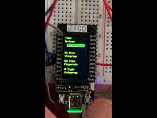
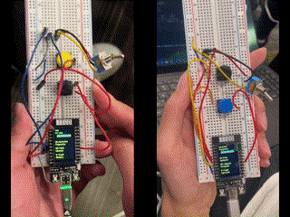

# 🚀 ESP Spaceteam 
##  👾 About
Play spaceteam with your friends on ESPs! 
This project took initial source code, and added functionality to it. You can find the intial source code here: https://github.com/ttseng/COMS3930-Fall2024/tree/main/Module%203.
The source code was a project that could be uploaded to an ESP32 LILYGO TTGO board. Then, with at least 2 players, one player could call out a task which could be fulfilled by another player pressing a button on that board.

In terms of design goals, we wanted to do a few different things:
1. Make the timer work
2. Make timer signals
3. Make task completion signals
4. Add hardware and more tasks
5. Change up the task names

Video Demonstration URL: https://www.youtube.com/watch?v=HqaP0ez_a80

    
    

## ⚙️ Fritzing and Added Hardware

In this project, we added extra functionality by adding some extra hardware. We implemented a toggle switch, and moved button functionality away from the buttons of the LILYGO TTGO ESP32 board buttons to external buttons. To set up the project such that it works, please following this fritzing diagram:

For gameplay: Button 1 is on the left, and Button 2 is on the right in this diagram.

Note: depending on the toggle switched used, you may be able to directly insert the pins into the breadboard however we did peform additional soldering to solder cables to the toggle switch pins to facilitate connection to the system 

## 🖥️ Software and UI Changes

Sensory input and testing:

Make sure that you have the Arduino IDE software and your ESP32 software installed. If you do not have Arduino IDE or the ESP32 LILYGO TTGO software, follow these instructions to install them: https://coms3930.notion.site/Lab-1-TFT-Display-a53b9c10137a4d95b22d301ec6009a94.

Once you have this installed, connect your board to the Arduino IDE, and upload and run the code from the espaceteam.ino file in the espaceteam folder.

In this project, we added extra software and UI changes from the original source code.  One of the major changes was the timer function, which now counts down from 40 seconds once a task is received. If the player gets their task completed, the timer will reset and the progress bar will increment by 1 out of 10 total. This progress bar was also changed from 100 in the original to 10. If they do not, then the game is over for them and they will have to restart with their progress bar back at 0.

Addtionally, we added some much needed sweet chaos for the user as their time runs out. We implemented some screen obstructions to make the screen a bit harder to read. At 10 seconds left, we added randomized but populous blue dots to simulate the space craft window getting cloudy and lost in space. At 5 seconds left we added even more obstructions in the form of random yellow lines to simulate flying debris on the spaceship screen making the instructions not as visible. We hoped that this added functionality helps add a nice level of surprise and challenge

There were also changes made for signaling to the player. If the player’s task is completed, then the border of the display will flash green to indicate that it was completed. There are also many time indicators. Once the user has run out of half their time, there will be moving red lines around the border. Then, as the timer runs out, the screen will fill with red dots and blue dots, before eventually going to a red “Game Over” screen if the timer fully runs out.

## 📋 Instructions for Setup

To run this on your own, have at least 2 people take the code in espaceteam.ino, which is in the espaceteam folder, and upload it to an LILYGO TTGO ESP32 board via Arduino IDE. Then, call out tasks to each other, while the other players fulfill those tasks!

When the round is over, click the reset button on the sides of each players ESP32 and play until your heart desires a halt!

## 🤖 Optional 3D prints

Under 3d-files folder, there consists an enclosure lid, enclosure base, and toggle switch cover to make the it easier to toggle the switch and press on the button with a more stable base. The decorative toggle switch cover was made to fit the switch and should friction fit over the toggle with the tight tolerances. 
